# Qubots: Modular Optimization Framework

[](https://pypi.org/project/qubots/)
[](https://github.com/leonidas1312/qubots/actions)
[](./LICENSE)

**Qubots** is a Python framework for building modular optimization solutions. It combines QUBO (Quadratic Unconstrained Binary Optimization) problems with algorithms in a LEGO-like modular architecture, enabling developers to mix and match optimization problems and solvers seamlessly.

## Architecture Overview

```mermaid
graph TB
    subgraph "📊 Data Input"
        D1["💼 Portfolio Dataset<br/>📄 stock_prices.csv<br/>📈 AAPL, GOOGL, MSFT<br/>💰 Returns & Risk Data"]
    end

    subgraph "🧩 Problem Repository"
        subgraph PR1["📦 portfolio-optimization-problem"]
            PR1_Q["🐍 qubot.py<br/>class PortfolioProblem(BaseProblem)<br/><br/>🔴 REQUIRED:<br/>• _get_default_metadata()<br/>• evaluate_solution()<br/><br/>🟡 OPTIONAL:<br/>• random_solution()<br/>• get_neighbor_solution()<br/>• is_feasible()"]
            PR1_C["⚙️ config.json<br/>{<br/>  'type': 'problem',<br/>  'class_name': 'PortfolioProblem'<br/>}"]
            PR1_R["📋 requirements.txt<br/>numpy>=1.20.0<br/>pandas>=1.3.0<br/>scipy>=1.7.0"]
        end
    end

    subgraph "⚡ Optimizer Repository"
        subgraph OR1["📦 genetic-algorithm-optimizer"]
            OR1_Q["🐍 qubot.py<br/>class GeneticOptimizer(BaseOptimizer)<br/><br/>🔴 REQUIRED:<br/>• _get_default_metadata()<br/>• _optimize_implementation()<br/><br/>🟡 OPTIONAL:<br/>• report_progress()<br/>• log_message()<br/>• should_stop()"]
            OR1_C["⚙️ config.json<br/>{<br/>  'type': 'optimizer',<br/>  'class_name': 'GeneticOptimizer'<br/>}"]
            OR1_R["📋 requirements.txt<br/>numpy>=1.20.0<br/>matplotlib>=3.0.0<br/>deap>=1.3.0"]
        end
    end

    subgraph "🎯 Decision Model Creation"
        DM["🔧 Load Components + Dataset<br/><br/>dataset = load_dataset_from_platform(<br/>    token='YOUR_TOKEN',<br/>    dataset_id='portfolio_data_id'<br/>)<br/><br/>problem = AutoProblem.from_repo(<br/>    'user/portfolio-problem',<br/>    override_params={'dataset': dataset}<br/>)<br/><br/>optimizer = AutoOptimizer.from_repo(<br/>    'user/genetic-optimizer'<br/>)<br/><br/>result = optimizer.optimize(problem)"]
    end

    subgraph "📈 Optimization Results"
        R1["📊 Portfolio Allocation<br/>AAPL: 35% | GOOGL: 40% | MSFT: 25%"]
        R2["📉 Risk Metrics<br/>Expected Return: 12.5%<br/>Volatility: 18.2%<br/>Sharpe Ratio: 0.68"]
        R3["📈 Visualization<br/>Efficient Frontier Plot<br/>Asset Allocation Pie Chart"]
    end

    %% Connections with labels
    D1 -->|"loads via API"| DM
    PR1 -->|"defines problem"| DM
    OR1 -->|"provides algorithm"| DM

    DM -->|"generates"| R1
    DM -->|"calculates"| R2
    DM -->|"creates"| R3

    %% Styling
    classDef dataStyle fill:#e3f2fd,stroke:#1976d2,stroke-width:3px,color:#000
    classDef problemStyle fill:#f3e5f5,stroke:#7b1fa2,stroke-width:3px,color:#000
    classDef optimizerStyle fill:#e8f5e8,stroke:#388e3c,stroke-width:3px,color:#000
    classDef modelStyle fill:#fff8e1,stroke:#f57c00,stroke-width:3px,color:#000
    classDef resultStyle fill:#fce4ec,stroke:#c2185b,stroke-width:3px,color:#000
    classDef fileStyle fill:#f5f5f5,stroke:#616161,stroke-width:2px,color:#000

    class D1 dataStyle
    class PR1 problemStyle
    class OR1 optimizerStyle
    class DM modelStyle
    class R1,R2,R3 resultStyle
    class PR1_Q,PR1_C,PR1_R,OR1_Q,OR1_C,OR1_R fileStyle
```



This example shows how **Portfolio Optimization** works in qubots:

1. **📊 Dataset**: Stock price data with returns and risk metrics
2. **🧩 Problem Repository**: Defines the portfolio optimization problem with evaluation methods
3. **⚡ Optimizer Repository**: Genetic algorithm that finds optimal asset allocations
4. **🎯 Decision Model**: Combines data + problem + optimizer using qubots' AutoLoad system
5. **📈 Results**: Generates allocation percentages, risk metrics, and visualizations

## Quick Start

### Installation

Clone the repository and install dependencies:

```bash
git clone https://github.com/Rastion/qubots.git
cd qubots
pip install -e .
```

### Running Tests

Test the framework with examples from the `examples/` directory:

```bash
# Test portfolio optimization
python examples/test_portfolio_optimization.py

# Test supply chain optimization
python examples/test_supply_chain_optimization.py

# Test molecular optimization
python examples/test_molecular_optimization.py

# Test other examples
python examples/test_*.py
```

### Uploading to Rastion Platform

Upload your qubots repositories to the [Rastion platform](https://rastion.com) for sharing and collaboration:

```bash
# Upload a problem or optimizer repository
python examples/upload_repo_to_rastion.py ./my_optimizer --token YOUR_RASTION_TOKEN

# Upload with custom name and description
python examples/upload_repo_to_rastion.py ./my_problem \
    --name "custom_vrp_solver" \
    --description "Advanced VRP solver with time windows" \
    --token YOUR_RASTION_TOKEN

# Upload as private repository
python examples/upload_repo_to_rastion.py ./my_optimizer \
    --private --token YOUR_RASTION_TOKEN
```

**Repository Requirements:**
- `qubot.py`: Main implementation file
- `config.json`: Configuration with type, entry_point, class_name, and metadata
- `requirements.txt`: Python dependencies 

Get your Rastion token from [rastion.com](https://rastion.com) after creating an account.

## Basic Usage

Load and run a maxcut demo optimization from the Rastion platform:

```python
from qubots import AutoProblem, AutoOptimizer

# Load a problem and optimizer from repositories
problem = AutoProblem.from_repo("Rastion/demo-maxcut")
optimizer = AutoOptimizer.from_repo("Rastion/demo-ortools-maxcut-optimizer")

# Run optimization
result = optimizer.optimize(problem)
print(f"Best Value: {result.best_value}")
print(f"Runtime: {result.runtime_seconds:.3f} seconds")
```

## Documentation

For comprehensive documentation, examples, and API reference, visit:

**📚 [https://docs.rastion.com](https://docs.rastion.com)**

The documentation includes:
- Detailed tutorials and examples
- Complete API reference
- Advanced configuration options
- Best practices and patterns
- Community contributions guide

## License

This project is licensed under the [Apache License 2.0](./LICENSE).

## Links

- **Homepage**: [rastion.com](https://rastion.com)
- **Documentation**: [docs.rastion.com](https://docs.rastion.com)
- **Repository**: [github.com/Rastion/qubots](https://github.com/Rastion/qubots)
- **PyPI**: [pypi.org/project/qubots](https://pypi.org/project/qubots/)